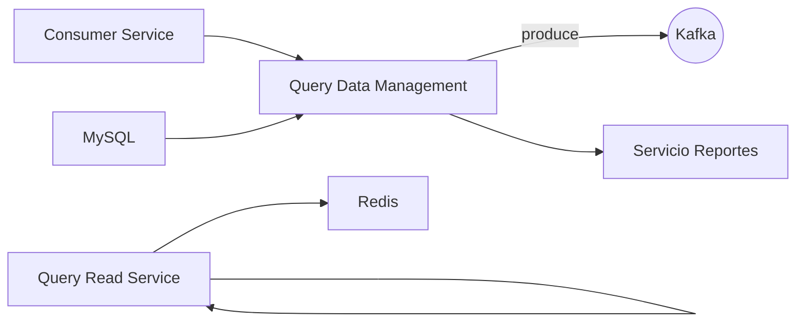

# 🚀 Proyecto de Microservicios - Gestión Financiera

Este proyecto está compuesto por **5 microservicios independientes** construidos con **Spring Boot**, **WebFlux**, **Redis**, **Kafka** y **MySQL**.  
El objetivo es manejar operaciones de clientes, cuentas, transacciones y generación de reportes bajo un enfoque **CQRS (Command Query Responsibility Segregation)** para separar la lógica de lectura y escritura.

---

## 📑 Índice

1. [Arquitectura General](#arquitectura-general)
2. [Tecnologías Utilizadas](#tecnologías-utilizadas)
3. [Microservicios](#microservicios)
4. [Patrón CQRS](#patrón-cqrs)
5. [Configuración e Instalación](#configuración-e-instalación)
6. [Ejecutar con Docker Compose](#ejecutar-con-docker-compose)
7. [Endpoints Principales](#endpoints-principales)
8. [Mensajería con Kafka](#mensajería-con-kafka)
9. [Cache con Redis](#cache-con-redis)
10. [Base de Datos](#base-de-datos)
11. [Generación de Reportes](#generación-de-reportes)
12. [Pruebas](#pruebas)
13. [Contribuciones](#contribuciones)
14. [Licencia](#licencia)

---

## 🏛️ Arquitectura General



- **CQRS** separa el manejo de comandos (crear, actualizar, eliminar) y consultas (reportes, búsquedas).
- **Kafka** se utiliza para la comunicación asincrónica entre servicios.
- **Redis** actúa como cache para optimizar consultas frecuentes.
- **MySQL** es la base de datos relacional para persistencia.  

## 🛠️ Tecnologías Utilizadas

- [Spring Boot](https://spring.io/projects/spring-boot)
- [Spring WebFlux](https://docs.spring.io/spring-framework/reference/web/webflux.html)
- [Spring Data JPA / R2DBC](https://spring.io/projects/spring-data-r2dbc)
- [Apache Kafka](https://kafka.apache.org/)
- [Redis](https://redis.io/)
- [MySQL](https://www.mysql.com/)
- [Docker & Docker Compose](https://www.docker.com/)

---

## ⚖️ Patrón CQRS

- **Comando (Write model)**:  
  Se encarga de procesar operaciones de creación, actualización y eliminación.
    - Microservicios involucrados: **Account service, Customer Service, Query data management**

- **Consulta (Read model)**:  
  Optimizado para consultas rápidas y reportes.
    - Microservicios involucrados: **Query Read Service**

---

## ⚙️ Configuración e Instalación

1. Clonar el repositorio:
   ```bash
   git clone https://github.com/leandroAmariles/customer-service-devsu.git
   git clone https://github.com/leandroAmariles/audit-transactions-devsu.git
   git clone https://github.com/leandroAmariles/query-data-management-devsu.git
   git clone https://github.com/leandroAmariles/account-service-devsu.git
   git clone https://github.com/leandroAmariles/query-read-service-devsu.git
   
   
   cd proyecto-financiero
   ```

2. Configurar las variables de entorno en `application.yml` o `.env`:
    - Credenciales de MySQL
    - Configuración de Kafka
    - Configuración de Redis  
    - 
## 📡 Endpoints Principales

### Clientes (CRUD)
- `POST /devsu/test/v1/clientes` → Crear cliente
- `GET /devsu/test/v1/clientes/1` → Obtener cliente
- `PATCH /devsu/test/v1/clientes/1` → Actualizar cliente
- `/devsu/test/v1/clientes/1` → Eliminar cliente

### Cuentas
- `POST /devsu/test/v1/cuentas` → Crear cuenta

### Transacciones
- `POST //devsu/test/v1/movimientos` → Crear transacción

### Reportes
- `GET /reportes?fechaInicio=2025-09-04 04:30:00&fechaFin=2025-09-04 04:33:15&nombreCliente=Leandro`

---

## 🧪 Pruebas

- **Unitarias**: con JUnit + Mockito.
- **Integración**: con H2 Database.


---